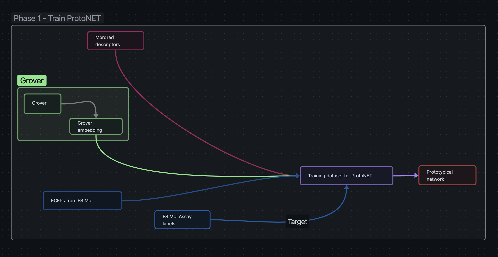

# Ersilia compound embedding

This library provides bioactivity aware chemical embeddings for small molecules.
The `lite` directory contains the `eosce` library intended for end-user use.
The `compound-embedding` library is intended for development use.

## Quick start guide

### 1. Clone the repository

```bash
git clone https://github.com/ersilia-os/compound-embedding.git
cd compound-embedding/lite
```

### 2. Install the package with pip

```bash
pip install -e .
```

or if you have a GPU

```bash
pip install -e .[gpu]
```

### 3. Programatically generate embeddings

```python
from eosce.models import ErsiliaCompoundEmbeddings
model = ErsiliaCompoundEmbeddings()
embeddings = model.transform(["CCOC(=O)C1=CC2=CC(OC)=CC=C2O1"])
```

### 4. Generate embeddings using the cli

```bash
eosce embed "CCOC(=O)C1=CC2=CC(OC)=CC=C2O1"
```

## Developing

### 1. Clone the repository

```bash
git clone https://github.com/ersilia-os/compound-embedding.git
cd compound-embedding
```

### 2. Create a conda environment and activate it

```bash
conda env create -f env.yaml
conda activate crux
```

### 3. Install the project using pip

```bash
pip install -e .
```

## Project Architecture

### Phase 1

We generated a unique dataset that contains grover descriptors, mordred descriptors and Assay labels for the molecules present in the FS-MOL dataset.
This dataset is then used to train a ProtoNET with euclidean distance as the metric.



### Phase 2

We then used the trained Protonet to generate 2 million embedding for the molecules in the reference library generated using CHEMBL.


### Phase 3

Finally we used the generated training dataset generated in Phase 2 to train a simple and fast neural network that maps ECFPs to embeddings generated by the ProtoNET.


## Getting required dataset

### FS-Mol Dataset

The FS-Mol dataset is available as a download, [FS-Mol Data](https://figshare.com/ndownloader/files/31345321), split into `train`, `valid` and `test` folders. 
Tasks are stored as individual compressed [JSONLines](https://jsonlines.org/) files, with each line corresponding to the information to a single datapoint for the task.
Each datapoint is stored as a JSON dictionary, following a fixed structure:
```json
{
    "SMILES": "SMILES_STRING",
    "Property": "ACTIVITY BOOL LABEL",
    "Assay_ID": "CHEMBL ID",
    "RegressionProperty": "ACTIVITY VALUE",
    "LogRegressionProperty": "LOG ACTIVITY VALUE",
    "Relation": "ASSUMED RELATION OF MEASURED VALUE TO TRUE VALUE",
    "AssayType": "TYPE OF ASSAY",
    "fingerprints": [...],
    "descriptors": [...],
    "graph": {
        "adjacency_lists": [
           [... SINGLE BONDS AS PAIRS ...],
           [... DOUBLE BONDS AS PAIRS ...],
           [... TRIPLE BONDS AS PAIRS ...]
        ],
        "node_types": [...ATOM TYPES...],
        "node_features": [...NODE FEATURES...],
    }
}
```

## Preprocessing pipelines

### Generate training data for ProtoNET

#### Merge Grover descriptors with FS-Mol Data

```bash
crux gen grover --inp "path/to/fs-mol/data" --out "path/to/save/output" 
```

#### Merge Mordred descriptors with FS-Mol Data

```bash
crux gen grover --inp "path/to/fs-mol-merged-grover/data" --out "path/to/save/output" 
```

#### Run qc checks to fix corrupted files

```bash
crux qc --inp "path/to/fs-mol/data" --out "path/to/fs-mol-merged-grover-mordred/data"
```

## Training protonet

```bash
crux train protonet \
    --save_dir path/to/save/trained_model \
    --data_dir "path/to/fs-mol-merged-grover-mordred/data" \
    --num_train_steps 10000
```

## Move fully trained model to package root

```bash
cp path/to/save/trained_model/FSMOL_protonet_{run identifier}/fully_trained.pt ./src/compound_embedding/
```

## Generate training data for Ersilia Compound Embeddings model

```bash
mpiexec -n 4 python gen_efp_train.py
```

This will create a `efp_training.hdf5` file in the directory where the command is executed.

## Train Ersilia Compund Embeddings model

```bash
crux train efp --save_dir /path/to/save/checkpoints --data_file /path/to/efp_training.hdf5
```

## License

This repository is open-sourced under [the GPL-3 License](https://github.com/ersilia-os/ersilia/blob/master/LICENSE). Please [cite us](https://github.com/ersilia-os/ersilia/blob/master/CITATION.cff) if you use it.

## About Us

The [Ersilia Open Source Initiative](https://ersilia.io) is a Non Profit Organization ([1192266](https://register-of-charities.charitycommission.gov.uk/charity-search/-/charity-details/5170657/full-print)) with the mission is to equip labs, universities and clinics in LMIC with AI/ML tools for infectious disease research.

[Help us](https://www.ersilia.io/donate) achieve our mission or [volunteer](https://www.ersilia.io/volunteer) with us!